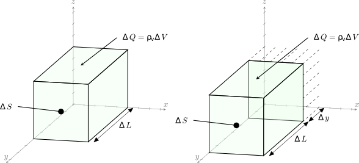

# Плотность тока
Электрические заряды, находящиеся в движении, формируют *электрический ток*.

*Электрическим током* называется всякое упорядоченное движение электрических зарядов в пространстве. 

*Силой тока* сквозь некоторую поверхность $S$ называется скалярная величина $I$, равная первой производной по времени от заряда $Q$, проходящего через эту поверхность: 

$$I=\frac{dQ}{dt}$$

Распределение электрического тока по сечению $S$ характеризуется *вектором плотности тока* $\vec{J}$ fff

